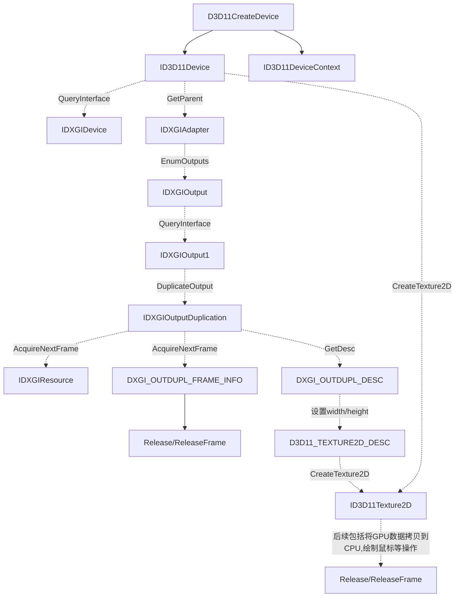

<!--more-->
# Windows DXGI 方式屏幕捕获实现

## 主要步骤



## 绘制鼠标

1. 方式1：使用 GDI 绘制鼠标
> IDXGISurface1 对象可通过IDXGISurface QueryInterface 获取.
```cpp
void DrawMouseCursor(IDXGISurface1 *p_DXGISurface1) {
  CURSORINFO cursorInfo = {sizeof(CURSORINFO)};
  ICONINFO iconInfo;
  bool isDraw = true;
  HDC hdc;

  cursorInfo.cbSize = sizeof(cursorInfo);
  p_DXGISurface1->GetDC(FALSE, &hdc);

  if (!GetCursorInfo(&cursorInfo)) {
    std::wcout << L"GetCursorInfo failed" << std::endl;
  }

  if (!(cursorInfo.flags & CURSOR_SHOWING)) {
    std::wcout << L"Cursor is not showing" << std::endl;
  }

  if (!GetIconInfo(cursorInfo.hCursor, &iconInfo)) {
    std::wcout << L"GetIconInfo failed" << std::endl;
  }

  if (!hdc || !cursorInfo.hCursor) {
    std::wcout << L"Failed to get bitmap" << std::endl;
  }

  if (cursorInfo.flags == CURSOR_SHOWING) {
    isDraw =
        DrawIconEx(hdc, cursorInfo.ptScreenPos.x, cursorInfo.ptScreenPos.y,
                   cursorInfo.hCursor, 0, 0, 0, 0, DI_NORMAL | DI_DEFAULTSIZE);
    if (!isDraw) {
      DWORD error = GetLastError();
      std::cerr << "DrawIconEx failed with error: " << error << std::endl;
    }

    DeleteObject(iconInfo.hbmColor);
    DeleteObject(iconInfo.hbmMask);
  }

  p_DXGISurface1->ReleaseDC(NULL);
}

```
1. 方式2：手动绘制鼠标
参考微软官方示例：[Windows-classic-samples](https://github.com/microsoft/Windows-classic-samples/blob/main/Samples/DXGIDesktopDuplication/cpp/OutputManager.cpp#L531)

主要代码如下：
```cpp
DUPL_RETURN OUTPUTMANAGER::ProcessMonoMask(bool IsMono, _Inout_ PTR_INFO* PtrInfo, _Out_ INT* PtrWidth, _Out_ INT* PtrHeight, _Out_ INT* PtrLeft, _Out_ INT* PtrTop, _Outptr_result_bytebuffer_(*PtrHeight * *PtrWidth * BPP) BYTE** InitBuffer, _Out_ D3D11_BOX* Box)
{
    // Desktop dimensions
    D3D11_TEXTURE2D_DESC FullDesc;
    m_SharedSurf->GetDesc(&FullDesc);
    INT DesktopWidth = FullDesc.Width;
    INT DesktopHeight = FullDesc.Height;

    // Pointer position
    INT GivenLeft = PtrInfo->Position.x;
    INT GivenTop = PtrInfo->Position.y;

    // Figure out if any adjustment is needed for out of bound positions
    if (GivenLeft < 0)
    {
        *PtrWidth = GivenLeft + static_cast<INT>(PtrInfo->ShapeInfo.Width);
    }
    else if ((GivenLeft + static_cast<INT>(PtrInfo->ShapeInfo.Width)) > DesktopWidth)
    {
        *PtrWidth = DesktopWidth - GivenLeft;
    }
    else
    {
        *PtrWidth = static_cast<INT>(PtrInfo->ShapeInfo.Width);
    }

    if (IsMono)
    {
        PtrInfo->ShapeInfo.Height = PtrInfo->ShapeInfo.Height / 2;
    }

    if (GivenTop < 0)
    {
        *PtrHeight = GivenTop + static_cast<INT>(PtrInfo->ShapeInfo.Height);
    }
    else if ((GivenTop + static_cast<INT>(PtrInfo->ShapeInfo.Height)) > DesktopHeight)
    {
        *PtrHeight = DesktopHeight - GivenTop;
    }
    else
    {
        *PtrHeight = static_cast<INT>(PtrInfo->ShapeInfo.Height);
    }

    if (IsMono)
    {
        PtrInfo->ShapeInfo.Height = PtrInfo->ShapeInfo.Height * 2;
    }

    *PtrLeft = (GivenLeft < 0) ? 0 : GivenLeft;
    *PtrTop = (GivenTop < 0) ? 0 : GivenTop;

    // Staging buffer/texture
    D3D11_TEXTURE2D_DESC CopyBufferDesc;
    CopyBufferDesc.Width = *PtrWidth;
    CopyBufferDesc.Height = *PtrHeight;
    CopyBufferDesc.MipLevels = 1;
    CopyBufferDesc.ArraySize = 1;
    CopyBufferDesc.Format = DXGI_FORMAT_B8G8R8A8_UNORM;
    CopyBufferDesc.SampleDesc.Count = 1;
    CopyBufferDesc.SampleDesc.Quality = 0;
    CopyBufferDesc.Usage = D3D11_USAGE_STAGING;
    CopyBufferDesc.BindFlags = 0;
    CopyBufferDesc.CPUAccessFlags = D3D11_CPU_ACCESS_READ;
    CopyBufferDesc.MiscFlags = 0;

    ID3D11Texture2D* CopyBuffer = nullptr;
    HRESULT hr = m_Device->CreateTexture2D(&CopyBufferDesc, nullptr, &CopyBuffer);
    if (FAILED(hr))
    {
        return ProcessFailure(m_Device, L"Failed creating staging texture for pointer", L"Error", hr, SystemTransitionsExpectedErrors);
    }

    // Copy needed part of desktop image
    Box->left = *PtrLeft;
    Box->top = *PtrTop;
    Box->right = *PtrLeft + *PtrWidth;
    Box->bottom = *PtrTop + *PtrHeight;
    m_DeviceContext->CopySubresourceRegion(CopyBuffer, 0, 0, 0, 0, m_SharedSurf, 0, Box);

    // QI for IDXGISurface
    IDXGISurface* CopySurface = nullptr;
    hr = CopyBuffer->QueryInterface(__uuidof(IDXGISurface), (void **)&CopySurface);
    CopyBuffer->Release();
    CopyBuffer = nullptr;
    if (FAILED(hr))
    {
        return ProcessFailure(nullptr, L"Failed to QI staging texture into IDXGISurface for pointer", L"Error", hr, SystemTransitionsExpectedErrors);
    }

    // Map pixels
    DXGI_MAPPED_RECT MappedSurface;
    hr = CopySurface->Map(&MappedSurface, DXGI_MAP_READ);
    if (FAILED(hr))
    {
        CopySurface->Release();
        CopySurface = nullptr;
        return ProcessFailure(m_Device, L"Failed to map surface for pointer", L"Error", hr, SystemTransitionsExpectedErrors);
    }

    // New mouseshape buffer
    *InitBuffer = new (std::nothrow) BYTE[*PtrWidth * *PtrHeight * BPP];
    if (!(*InitBuffer))
    {
        return ProcessFailure(nullptr, L"Failed to allocate memory for new mouse shape buffer.", L"Error", E_OUTOFMEMORY);
    }

    UINT* InitBuffer32 = reinterpret_cast<UINT*>(*InitBuffer);
    UINT* Desktop32 = reinterpret_cast<UINT*>(MappedSurface.pBits);
    UINT  DesktopPitchInPixels = MappedSurface.Pitch / sizeof(UINT);

    // What to skip (pixel offset)
    UINT SkipX = (GivenLeft < 0) ? (-1 * GivenLeft) : (0);
    UINT SkipY = (GivenTop < 0) ? (-1 * GivenTop) : (0);

    if (IsMono)
    {
        for (INT Row = 0; Row < *PtrHeight; ++Row)
        {
            // Set mask
            BYTE Mask = 0x80;
            Mask = Mask >> (SkipX % 8);
            for (INT Col = 0; Col < *PtrWidth; ++Col)
            {
                // Get masks using appropriate offsets
                BYTE AndMask = PtrInfo->PtrShapeBuffer[((Col + SkipX) / 8) + ((Row + SkipY) * (PtrInfo->ShapeInfo.Pitch))] & Mask;
                BYTE XorMask = PtrInfo->PtrShapeBuffer[((Col + SkipX) / 8) + ((Row + SkipY + (PtrInfo->ShapeInfo.Height / 2)) * (PtrInfo->ShapeInfo.Pitch))] & Mask;
                UINT AndMask32 = (AndMask) ? 0xFFFFFFFF : 0xFF000000;
                UINT XorMask32 = (XorMask) ? 0x00FFFFFF : 0x00000000;

                // Set new pixel
                InitBuffer32[(Row * *PtrWidth) + Col] = (Desktop32[(Row * DesktopPitchInPixels) + Col] & AndMask32) ^ XorMask32;

                // Adjust mask
                if (Mask == 0x01)
                {
                    Mask = 0x80;
                }
                else
                {
                    Mask = Mask >> 1;
                }
            }
        }
    }
    else
    {
        UINT* Buffer32 = reinterpret_cast<UINT*>(PtrInfo->PtrShapeBuffer);

        // Iterate through pixels
        for (INT Row = 0; Row < *PtrHeight; ++Row)
        {
            for (INT Col = 0; Col < *PtrWidth; ++Col)
            {
                // Set up mask
                UINT MaskVal = 0xFF000000 & Buffer32[(Col + SkipX) + ((Row + SkipY) * (PtrInfo->ShapeInfo.Pitch / sizeof(UINT)))];
                if (MaskVal)
                {
                    // Mask was 0xFF
                    InitBuffer32[(Row * *PtrWidth) + Col] = (Desktop32[(Row * DesktopPitchInPixels) + Col] ^ Buffer32[(Col + SkipX) + ((Row + SkipY) * (PtrInfo->ShapeInfo.Pitch / sizeof(UINT)))]) | 0xFF000000;
                }
                else
                {
                    // Mask was 0x00
                    InitBuffer32[(Row * *PtrWidth) + Col] = Buffer32[(Col + SkipX) + ((Row + SkipY) * (PtrInfo->ShapeInfo.Pitch / sizeof(UINT)))] | 0xFF000000;
                }
            }
        }
    }

    // Done with resource
    hr = CopySurface->Unmap();
    CopySurface->Release();
    CopySurface = nullptr;
    if (FAILED(hr))
    {
        return ProcessFailure(m_Device, L"Failed to unmap surface for pointer", L"Error", hr, SystemTransitionsExpectedErrors);
    }

    return DUPL_RETURN_SUCCESS;
}

//
// Draw mouse provided in buffer to backbuffer
//
DUPL_RETURN OUTPUTMANAGER::DrawMouse(_In_ PTR_INFO* PtrInfo)
{
    // Vars to be used
    ID3D11Texture2D* MouseTex = nullptr;
    ID3D11ShaderResourceView* ShaderRes = nullptr;
    ID3D11Buffer* VertexBufferMouse = nullptr;
    D3D11_SUBRESOURCE_DATA InitData;
    D3D11_TEXTURE2D_DESC Desc;
    D3D11_SHADER_RESOURCE_VIEW_DESC SDesc;

    // Position will be changed based on mouse position
    VERTEX Vertices[NUMVERTICES] =
    {
        {XMFLOAT3(-1.0f, -1.0f, 0), XMFLOAT2(0.0f, 1.0f)},
        {XMFLOAT3(-1.0f, 1.0f, 0), XMFLOAT2(0.0f, 0.0f)},
        {XMFLOAT3(1.0f, -1.0f, 0), XMFLOAT2(1.0f, 1.0f)},
        {XMFLOAT3(1.0f, -1.0f, 0), XMFLOAT2(1.0f, 1.0f)},
        {XMFLOAT3(-1.0f, 1.0f, 0), XMFLOAT2(0.0f, 0.0f)},
        {XMFLOAT3(1.0f, 1.0f, 0), XMFLOAT2(1.0f, 0.0f)},
    };

    D3D11_TEXTURE2D_DESC FullDesc;
    m_SharedSurf->GetDesc(&FullDesc);
    INT DesktopWidth = FullDesc.Width;
    INT DesktopHeight = FullDesc.Height;

    // Center of desktop dimensions
    INT CenterX = (DesktopWidth / 2);
    INT CenterY = (DesktopHeight / 2);

    // Clipping adjusted coordinates / dimensions
    INT PtrWidth = 0;
    INT PtrHeight = 0;
    INT PtrLeft = 0;
    INT PtrTop = 0;

    // Buffer used if necessary (in case of monochrome or masked pointer)
    BYTE* InitBuffer = nullptr;

    // Used for copying pixels
    D3D11_BOX Box;
    Box.front = 0;
    Box.back = 1;

    Desc.MipLevels = 1;
    Desc.ArraySize = 1;
    Desc.Format = DXGI_FORMAT_B8G8R8A8_UNORM;
    Desc.SampleDesc.Count = 1;
    Desc.SampleDesc.Quality = 0;
    Desc.Usage = D3D11_USAGE_DEFAULT;
    Desc.BindFlags = D3D11_BIND_SHADER_RESOURCE;
    Desc.CPUAccessFlags = 0;
    Desc.MiscFlags = 0;

    // Set shader resource properties
    SDesc.Format = Desc.Format;
    SDesc.ViewDimension = D3D11_SRV_DIMENSION_TEXTURE2D;
    SDesc.Texture2D.MostDetailedMip = Desc.MipLevels - 1;
    SDesc.Texture2D.MipLevels = Desc.MipLevels;

    switch (PtrInfo->ShapeInfo.Type)
    {
        case DXGI_OUTDUPL_POINTER_SHAPE_TYPE_COLOR:
        {
            PtrLeft = PtrInfo->Position.x;
            PtrTop = PtrInfo->Position.y;

            PtrWidth = static_cast<INT>(PtrInfo->ShapeInfo.Width);
            PtrHeight = static_cast<INT>(PtrInfo->ShapeInfo.Height);

            break;
        }

        case DXGI_OUTDUPL_POINTER_SHAPE_TYPE_MONOCHROME:
        {
            ProcessMonoMask(true, PtrInfo, &PtrWidth, &PtrHeight, &PtrLeft, &PtrTop, &InitBuffer, &Box);
            break;
        }

        case DXGI_OUTDUPL_POINTER_SHAPE_TYPE_MASKED_COLOR:
        {
            ProcessMonoMask(false, PtrInfo, &PtrWidth, &PtrHeight, &PtrLeft, &PtrTop, &InitBuffer, &Box);
            break;
        }

        default:
            break;
    }

    // VERTEX creation
    Vertices[0].Pos.x = (PtrLeft - CenterX) / (FLOAT)CenterX;
    Vertices[0].Pos.y = -1 * ((PtrTop + PtrHeight) - CenterY) / (FLOAT)CenterY;
    Vertices[1].Pos.x = (PtrLeft - CenterX) / (FLOAT)CenterX;
    Vertices[1].Pos.y = -1 * (PtrTop - CenterY) / (FLOAT)CenterY;
    Vertices[2].Pos.x = ((PtrLeft + PtrWidth) - CenterX) / (FLOAT)CenterX;
    Vertices[2].Pos.y = -1 * ((PtrTop + PtrHeight) - CenterY) / (FLOAT)CenterY;
    Vertices[3].Pos.x = Vertices[2].Pos.x;
    Vertices[3].Pos.y = Vertices[2].Pos.y;
    Vertices[4].Pos.x = Vertices[1].Pos.x;
    Vertices[4].Pos.y = Vertices[1].Pos.y;
    Vertices[5].Pos.x = ((PtrLeft + PtrWidth) - CenterX) / (FLOAT)CenterX;
    Vertices[5].Pos.y = -1 * (PtrTop - CenterY) / (FLOAT)CenterY;

    // Set texture properties
    Desc.Width = PtrWidth;
    Desc.Height = PtrHeight;

    // Set up init data
    InitData.pSysMem = (PtrInfo->ShapeInfo.Type == DXGI_OUTDUPL_POINTER_SHAPE_TYPE_COLOR) ? PtrInfo->PtrShapeBuffer : InitBuffer;
    InitData.SysMemPitch = (PtrInfo->ShapeInfo.Type == DXGI_OUTDUPL_POINTER_SHAPE_TYPE_COLOR) ? PtrInfo->ShapeInfo.Pitch : PtrWidth * BPP;
    InitData.SysMemSlicePitch = 0;

    // Create mouseshape as texture
    HRESULT hr = m_Device->CreateTexture2D(&Desc, &InitData, &MouseTex);
    if (FAILED(hr))
    {
        return ProcessFailure(m_Device, L"Failed to create mouse pointer texture", L"Error", hr, SystemTransitionsExpectedErrors);
    }

    // Create shader resource from texture
    hr = m_Device->CreateShaderResourceView(MouseTex, &SDesc, &ShaderRes);
    if (FAILED(hr))
    {
        MouseTex->Release();
        MouseTex = nullptr;
        return ProcessFailure(m_Device, L"Failed to create shader resource from mouse pointer texture", L"Error", hr, SystemTransitionsExpectedErrors);
    }

    D3D11_BUFFER_DESC BDesc;
    ZeroMemory(&BDesc, sizeof(D3D11_BUFFER_DESC));
    BDesc.Usage = D3D11_USAGE_DEFAULT;
    BDesc.ByteWidth = sizeof(VERTEX) * NUMVERTICES;
    BDesc.BindFlags = D3D11_BIND_VERTEX_BUFFER;
    BDesc.CPUAccessFlags = 0;

    ZeroMemory(&InitData, sizeof(D3D11_SUBRESOURCE_DATA));
    InitData.pSysMem = Vertices;

    // Create vertex buffer
    hr = m_Device->CreateBuffer(&BDesc, &InitData, &VertexBufferMouse);
    if (FAILED(hr))
    {
        ShaderRes->Release();
        ShaderRes = nullptr;
        MouseTex->Release();
        MouseTex = nullptr;
        return ProcessFailure(m_Device, L"Failed to create mouse pointer vertex buffer in OutputManager", L"Error", hr, SystemTransitionsExpectedErrors);
    }

    // Set resources
    FLOAT BlendFactor[4] = {0.f, 0.f, 0.f, 0.f};
    UINT Stride = sizeof(VERTEX);
    UINT Offset = 0;
    m_DeviceContext->IASetVertexBuffers(0, 1, &VertexBufferMouse, &Stride, &Offset);
    m_DeviceContext->OMSetBlendState(m_BlendState, BlendFactor, 0xFFFFFFFF);
    m_DeviceContext->OMSetRenderTargets(1, &m_RTV, nullptr);
    m_DeviceContext->VSSetShader(m_VertexShader, nullptr, 0);
    m_DeviceContext->PSSetShader(m_PixelShader, nullptr, 0);
    m_DeviceContext->PSSetShaderResources(0, 1, &ShaderRes);
    m_DeviceContext->PSSetSamplers(0, 1, &m_SamplerLinear);

    // Draw
    m_DeviceContext->Draw(NUMVERTICES, 0);

    // Clean
    if (VertexBufferMouse)
    {
        VertexBufferMouse->Release();
        VertexBufferMouse = nullptr;
    }
    if (ShaderRes)
    {
        ShaderRes->Release();
        ShaderRes = nullptr;
    }
    if (MouseTex)
    {
        MouseTex->Release();
        MouseTex = nullptr;
    }
    if (InitBuffer)
    {
        delete [] InitBuffer;
        InitBuffer = nullptr;
    }

    return DUPL_RETURN_SUCCESS;
}
```

## 完整代码示例
```cpp
#include <Windows.h>
#include <d3d11.h>
#include <d3d12.h>
#include <dxgi1_2.h>
#include <iostream>
#include <string>
#include <windef.h>
#include <wingdi.h>

#define PRINT_ERR(msg, hr)                                                     \
  std::cerr << msg << " failed with error code " << hr << std::endl;

#pragma comment(lib, "D3D11.lib")

const D3D_DRIVER_TYPE driverTypes[] = {
    D3D_DRIVER_TYPE_HARDWARE, D3D_DRIVER_TYPE_WARP, D3D_DRIVER_TYPE_REFERENCE};

const D3D_FEATURE_LEVEL featureLevels[] = {
    D3D_FEATURE_LEVEL_11_0, D3D_FEATURE_LEVEL_10_1, D3D_FEATURE_LEVEL_10_0,
    D3D_FEATURE_LEVEL_9_1};

bool GetMouseInfo(CURSORINFO &cursorInfo, ICONINFO &iconInfo) {
  cursorInfo.cbSize = sizeof(cursorInfo);

  if (!GetCursorInfo(&cursorInfo)) {
    std::wcout << L"GetCursorInfo failed" << std::endl;
    return false;
  }

  if (!(cursorInfo.flags & CURSOR_SHOWING)) {
    std::wcout << L"Cursor is not showing" << std::endl;
    return false;
  }

  if (!GetIconInfo(cursorInfo.hCursor, &iconInfo)) {
    std::wcout << L"GetIconInfo failed" << std::endl;
    return false;
  }

  return true;
}

void DrawMouseCursor(IDXGISurface1 *p_DXGISurface1) {
  CURSORINFO cursorInfo = {sizeof(CURSORINFO)};
  ICONINFO iconInfo;
  bool isDraw = true;
  HDC hdc;

  cursorInfo.cbSize = sizeof(cursorInfo);
  p_DXGISurface1->GetDC(FALSE, &hdc);

  if (!GetCursorInfo(&cursorInfo)) {
    std::wcout << L"GetCursorInfo failed" << std::endl;
  }

  if (!(cursorInfo.flags & CURSOR_SHOWING)) {
    std::wcout << L"Cursor is not showing" << std::endl;
  }

  if (!GetIconInfo(cursorInfo.hCursor, &iconInfo)) {
    std::wcout << L"GetIconInfo failed" << std::endl;
  }

  if (!hdc || !cursorInfo.hCursor) {
    std::wcout << L"Failed to get bitmap" << std::endl;
  }

  if (cursorInfo.flags == CURSOR_SHOWING) {
    isDraw =
        DrawIconEx(hdc, cursorInfo.ptScreenPos.x, cursorInfo.ptScreenPos.y,
                   cursorInfo.hCursor, 0, 0, 0, 0, DI_NORMAL | DI_DEFAULTSIZE);
    if (!isDraw) {
      DWORD error = GetLastError();
      std::cerr << "DrawIconEx failed with error: " << error << std::endl;
    }

    DeleteObject(iconInfo.hbmColor);
    DeleteObject(iconInfo.hbmMask);
  }

  p_DXGISurface1->ReleaseDC(NULL);
}

void DrawMouseCursor(ID3D11DeviceContext *g_pImmediateContext,
                     ID3D11Device *g_pd3dDevice,
                     D3D11_MAPPED_SUBRESOURCE mappedResource) {
  CURSORINFO cursorInfo;
  ICONINFO iconInfo;
  HDC hdc = CreateCompatibleDC(NULL);

  if (!GetMouseInfo(cursorInfo, iconInfo)) {
    std::wcout << L"Failed to get mouse info" << std::endl;
    return;
  }

  HBITMAP hBitmap = iconInfo.hbmColor ? iconInfo.hbmColor : iconInfo.hbmMask;
  if (!hBitmap) {
    std::wcout << L"Failed to get bitmap" << std::endl;
    return;
  }

  SelectObject(hdc, hBitmap);

  BITMAP bitmap;
  GetObject(hBitmap, sizeof(BITMAP), &bitmap);

  BITMAPINFO bmi = {0};
  bmi.bmiHeader.biSize = sizeof(BITMAPINFOHEADER);
  bmi.bmiHeader.biWidth = bitmap.bmWidth;
  bmi.bmiHeader.biHeight = bitmap.bmHeight;
  bmi.bmiHeader.biPlanes = 1;
  bmi.bmiHeader.biBitCount = 32;
  bmi.bmiHeader.biCompression = BI_RGB;
}

void RGBDataSaveAsBmpFile(const char *bmpFile, unsigned char *pRgbData,
                          int width, int height, int biBitCount,
                          bool flipVertical) {
  int size = 0;
  int bitsPerPixel = 3;
  if (biBitCount == 24) {
    bitsPerPixel = 3;
    size = width * height * bitsPerPixel * sizeof(char);
  } else if (biBitCount == 32) {
    bitsPerPixel = 4;
    size = width * height * bitsPerPixel * sizeof(char);
  } else
    return;

  BITMAPFILEHEADER bfh;
  bfh.bfType = (WORD)0x4d42;
  bfh.bfOffBits = sizeof(BITMAPFILEHEADER) + sizeof(BITMAPINFOHEADER);
  bfh.bfSize = size + bfh.bfOffBits;
  bfh.bfReserved1 = 0;
  bfh.bfReserved2 = 0;

  BITMAPINFOHEADER bih;
  bih.biSize = sizeof(BITMAPINFOHEADER);
  bih.biWidth = width;
  if (flipVertical)
    bih.biHeight = -height;
  else
    bih.biHeight = height;
  bih.biPlanes = 1;
  bih.biBitCount = biBitCount;
  bih.biCompression = BI_RGB;
  bih.biSizeImage = size;
  bih.biXPelsPerMeter = 0;
  bih.biYPelsPerMeter = 0;
  bih.biClrUsed = 0;
  bih.biClrImportant = 0;
  FILE *fp = NULL;
  fopen_s(&fp, bmpFile, "wb");
  if (!fp)
    return;

  fwrite(&bfh, sizeof(bfh), 1, fp);
  // fwrite(&bfh, 8, 1, fp);
  // fwrite(&bfh.bfReserved2, sizeof(bfh.bfReserved2), 1, fp);
  // fwrite(&bfh.bfOffBits, sizeof(bfh.bfOffBits), 1, fp);
  fwrite(&bih, sizeof(BITMAPINFOHEADER), 1, fp);
  fwrite(pRgbData, size, 1, fp);
  fclose(fp);
}

void PrintHResultError(HRESULT hr) {
  LPVOID lpMsgBuf;
  DWORD dwFlags = FORMAT_MESSAGE_ALLOCATE_BUFFER | FORMAT_MESSAGE_FROM_SYSTEM |
                  FORMAT_MESSAGE_IGNORE_INSERTS;

  FormatMessage(dwFlags, NULL, hr, MAKELANGID(LANG_NEUTRAL, SUBLANG_DEFAULT),
                (LPTSTR)&lpMsgBuf, 0, NULL);

  std::wcout << L"Error: " << (LPTSTR)lpMsgBuf << std::endl;
  LocalFree(lpMsgBuf);
}

struct ScreenCapture {
  ID3D11Device *p_pd3dDevice;
  ID3D11DeviceContext *p_pImmediateContext;
  D3D_FEATURE_LEVEL featureLevel;
  IDXGIOutputDuplication *p_dxgiOutputDuplication;
  IDXGISurface1 *p_DesktopSurface1;
  IDXGIResource *p_DesktopResource;
  ID3D11Texture2D *p_ID3D11Texture2D;
  DXGI_OUTDUPL_FRAME_INFO frameInfo;
  D3D11_TEXTURE2D_DESC p_D3D11TextureDesc;

  HRESULT InitDevice() {
    HRESULT hr = S_OK;

    for (const auto &driverType : driverTypes) {
      hr = D3D11CreateDevice(nullptr, driverType, nullptr, 0, featureLevels,
                             //  ARRAYSIZE(featureLevels),
                             static_cast<UINT>(std::size(featureLevels)),
                             D3D11_SDK_VERSION, &p_pd3dDevice, &featureLevel,
                             &p_pImmediateContext);
      if (SUCCEEDED(hr)) {
        return hr;
      }
    }

    return hr;
  }

  HRESULT
  GetOutputDuplication(int monitorIndex) {
    IDXGIDevice *p_dxgiDevice = nullptr;
    IDXGIAdapter *p_DxgiAdapter = nullptr;
    HRESULT hr = S_OK;

    if (!p_pd3dDevice) {
      std::wcout << L"Failed to create device and context" << std::endl;
      return hr;
    }

    hr = p_pd3dDevice->QueryInterface(IID_PPV_ARGS(&p_dxgiDevice));
    if (FAILED(hr)) {
      PRINT_ERR("p_pd3dDevice->QueryInterface", hr);
      return hr;
    }

    hr = p_dxgiDevice->GetParent(IID_PPV_ARGS(&p_DxgiAdapter));
    if (FAILED(hr)) {
      PRINT_ERR("p_dxgiDevice->GetParent", hr);
      return hr;
    }

    IDXGIOutput *p_DxgiOutput = nullptr;
    hr = p_DxgiAdapter->EnumOutputs(monitorIndex, &p_DxgiOutput);
    if (FAILED(hr)) {
      PRINT_ERR("p_DxgiAdapter->EnumOutputs", hr);
      return hr;
    }

    IDXGIOutput1 *p_DxgiOutput1 = nullptr;
    hr = p_DxgiOutput->QueryInterface(IID_PPV_ARGS(&p_DxgiOutput1));
    if (FAILED(hr)) {
      PRINT_ERR("p_DxgiOutput->QueryInterface", hr);
      return hr;
    }

    hr = p_DxgiOutput1->DuplicateOutput(p_pd3dDevice, &p_dxgiOutputDuplication);
    if (FAILED(hr)) {
      PRINT_ERR("p_DxgiOutput1->DuplicateOutput", hr);
      return hr;
    }

    return hr;
  }

  HRESULT AcquiredDesktopImage() {
    HRESULT hr = S_OK;

    hr = p_dxgiOutputDuplication->AcquireNextFrame(1000, &frameInfo,
                                                   &p_DesktopResource);
    if (FAILED(hr)) {
      PRINT_ERR("p_dxgiOutputDuplication->AcquireNextFrame", hr);
      return hr;
    } else if (frameInfo.LastPresentTime.QuadPart == 0) {
      p_DesktopResource->Release();
      p_dxgiOutputDuplication->ReleaseFrame();
    }

    hr = p_DesktopResource->QueryInterface(IID_PPV_ARGS(&p_DesktopResource));
    if (FAILED(hr)) {
      PRINT_ERR("p_DesktopResource->QueryInterface", hr);
      return hr;
    }

    hr = p_DesktopResource->QueryInterface(IID_PPV_ARGS(&p_ID3D11Texture2D));
    if (FAILED(hr)) {
      PRINT_ERR("p_DesktopResource->QueryInterface", hr);
      return hr;
    }

    return hr;
  }

  HRESULT CaptureDesktopImage(const char *bmpFilename) {

    DXGI_OUTDUPL_DESC p_dxgiOutputDuplicationDesc;
    ID3D11Texture2D *p_DesktopTexture = nullptr;
    ID3D11Texture2D *p_ID3DTexture2dGDI = nullptr;
    ID3D11Texture2D *p_ID3DTexture2dCPU = nullptr;
    HRESULT hr = S_OK;

    p_dxgiOutputDuplication->GetDesc(&p_dxgiOutputDuplicationDesc);

    p_D3D11TextureDesc.Width = p_dxgiOutputDuplicationDesc.ModeDesc.Width;
    p_D3D11TextureDesc.Height = p_dxgiOutputDuplicationDesc.ModeDesc.Height;
    p_D3D11TextureDesc.Format = p_dxgiOutputDuplicationDesc.ModeDesc.Format;
    p_D3D11TextureDesc.ArraySize = 1;
    p_D3D11TextureDesc.BindFlags = D3D11_BIND_RENDER_TARGET;
    p_D3D11TextureDesc.MiscFlags = D3D11_RESOURCE_MISC_GDI_COMPATIBLE;
    p_D3D11TextureDesc.SampleDesc.Count = 1;
    p_D3D11TextureDesc.SampleDesc.Quality = 0;
    p_D3D11TextureDesc.Usage = D3D11_USAGE_DEFAULT;
    p_D3D11TextureDesc.CPUAccessFlags = 0;
    p_D3D11TextureDesc.MipLevels = 1;

    hr = p_pd3dDevice->CreateTexture2D(&p_D3D11TextureDesc, nullptr,
                                       &p_ID3DTexture2dGDI);
    if (FAILED(hr)) {
      PRINT_ERR("g_pd3dDevice->CreateTexture2D", hr);
      return hr;
    }

    p_D3D11TextureDesc.BindFlags = 0;
    p_D3D11TextureDesc.MiscFlags = 0;
    p_D3D11TextureDesc.CPUAccessFlags =
        D3D11_CPU_ACCESS_READ | D3D11_CPU_ACCESS_WRITE;
    p_D3D11TextureDesc.Usage = D3D11_USAGE_STAGING;
    hr = p_pd3dDevice->CreateTexture2D(&p_D3D11TextureDesc, nullptr,
                                       &p_ID3DTexture2dCPU);
    if (FAILED(hr)) {
      PRINT_ERR("g_pd3dDevice->CreateTexture2D", hr);
      return hr;
    }

    p_pImmediateContext->CopyResource(p_ID3DTexture2dGDI, p_ID3D11Texture2D);

    IDXGISurface1 *p_DesktopSurface1 = nullptr;
    hr = p_ID3DTexture2dGDI->QueryInterface(IID_PPV_ARGS(&p_DesktopSurface1));
    if (FAILED(hr)) {
      PRINT_ERR("p_DesktopResource->QueryInterface", hr);
      return hr;
    }

    if (!frameInfo.PointerPosition.Visible) {
      DrawMouseCursor(p_DesktopSurface1);
    }

    p_pImmediateContext->CopyResource(p_ID3DTexture2dCPU, p_ID3DTexture2dGDI);

    DXGI_MAPPED_RECT dxgiMappedRect;
    IDXGISurface *p_IDXGISurface = nullptr;

    hr = p_ID3DTexture2dCPU->QueryInterface(&p_IDXGISurface);
    if (FAILED(hr)) {
      PRINT_ERR("p_ID3DTexture2dCPU->QueryInterface", hr);
      return hr;
    }

    hr = p_IDXGISurface->Map(&dxgiMappedRect, DXGI_MAP_READ);
    if (FAILED(hr)) {
      PRINT_ERR("p_IDXGISurface->Map", hr);
      return hr;
    }

    RGBDataSaveAsBmpFile(bmpFilename, (unsigned char *)dxgiMappedRect.pBits,
                         p_D3D11TextureDesc.Width, p_D3D11TextureDesc.Height,
                         32, true);

    hr = p_IDXGISurface->Unmap();
    if (FAILED(hr)) {
      PRINT_ERR("p_IDXGISurface->Unmap", hr);
      return hr;
    }

    p_IDXGISurface->Release();
    p_DesktopSurface1->Release();
    p_ID3DTexture2dCPU->Release();
    p_ID3DTexture2dGDI->Release();
    p_DesktopResource->Release();
    p_dxgiOutputDuplication->ReleaseFrame();

    return hr;
  }
};

HRESULT StartCapture() {
  ScreenCapture screenCapture;
  HRESULT hr = S_OK;

  hr = screenCapture.InitDevice();
  if (FAILED(hr)) {
    PRINT_ERR("InitDevice", hr);
    return hr;
  }

  hr = screenCapture.GetOutputDuplication(0);
  if (FAILED(hr)) {
    PRINT_ERR("GetOutputDuplication", hr);
    return hr;
  }

  for (int i = 0; i < 3; ++i) {
    std::string bmpFilename = "../../";
    hr = screenCapture.AcquiredDesktopImage();
    if (FAILED(hr)) {
      PRINT_ERR("AcquiredDesktopImage", hr);
      return hr;
    }

    bmpFilename.append("screenshot");
    bmpFilename.append(std::to_string(i));
    bmpFilename.append(".bmp");

    hr = screenCapture.CaptureDesktopImage(bmpFilename.c_str());
    if (FAILED(hr)) {
      PRINT_ERR("CaptureDesktopImage", hr);
      return hr;
    }

    hr = screenCapture.AcquiredDesktopImage();
    if (FAILED(hr)) {
      PRINT_ERR("AcquiredDesktopImage", hr);
      return hr;
    }
    screenCapture.CaptureDesktopImage(bmpFilename.c_str());
    screenCapture.p_dxgiOutputDuplication->ReleaseFrame();
  }

  return hr;
}

int main() { return StartCapture(); }
```

## 参考资料
- [DiscreteTom/rusty-duplication: Capture the screen on Windows using the Desktop Duplication API in Rust, with shared memory support.](https://github.com/DiscreteTom/rusty-duplication)
- [win32 - 使用Desktop Duplication API复制桌面图像 - strive-sun - 博客园](https://www.cnblogs.com/strive-sun/p/14549569.html)
- [捕捉屏幕的各种方法 - Dincat - 博客园](https://www.cnblogs.com/Dincat/p/13462483.html)
- [screen-recorder](https://github.com/peilinok/screen-recorder/tree/master)
- [Windows-classic-samples](https://github.com/microsoft/Windows-classic-samples/blob/main/Samples/DXGIDesktopDuplication/cpp/OutputManager.cpp#L531)
- [dxgi_outdupl_pointer_shape_type](https://learn.microsoft.com/en-us/windows/win32/api/dxgi1_2/ne-dxgi1_2-dxgi_outdupl_pointer_shape_type)
-