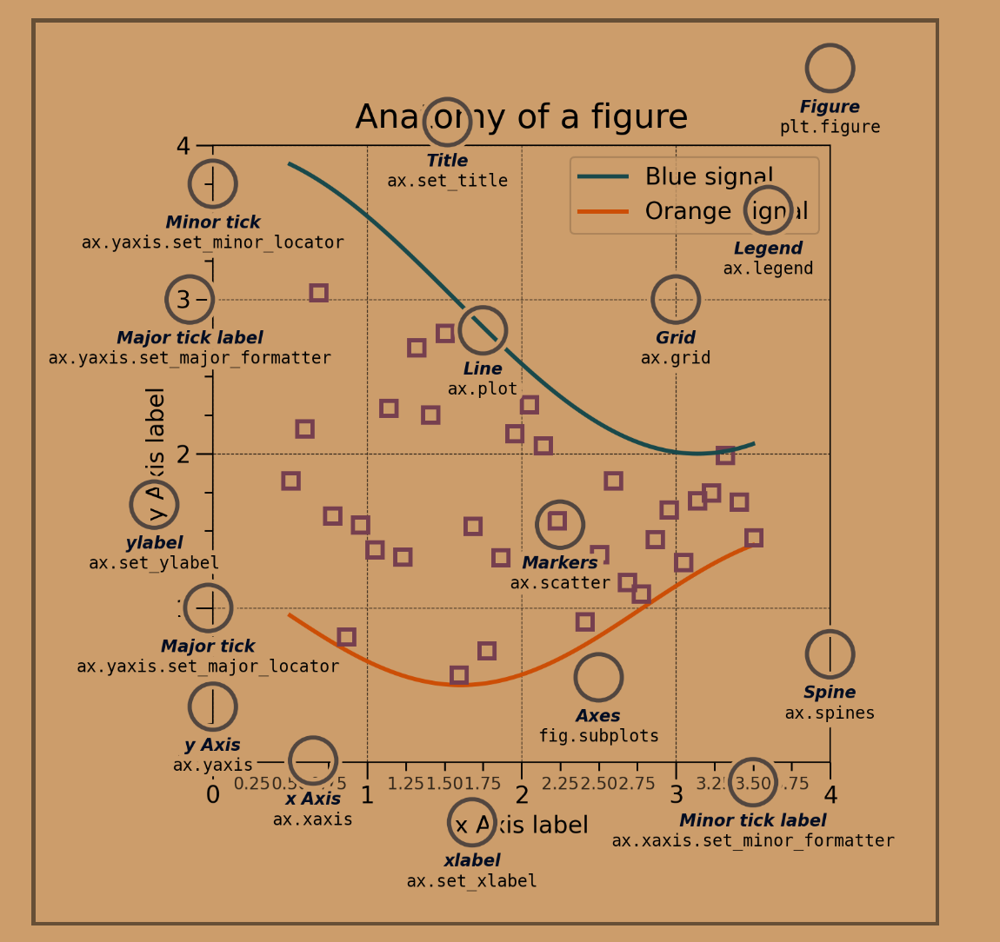

<!--more-->

# matplotlib的简单使用

**matplotlib结构**



## 1. fig,ax,plt 三者的基本概念

- fig
    - `Figure`，就是图的**外框**，也叫**画布**，可以包括`1-无穷`个内框`Axes`
- ax
    - `Axes`，就是图的**内框**(可以将画布分为多个绘图区域)，里面可以画各种图，最常见的就是`二维的统计图`或者`折线图`，也可以画`三维图xyz`和`极坐标图theta-r`
    - `Axis`，就是坐标轴
- plt
    - Pyplot为底层面向对象的绘图库提供状态机接口。状态机隐式自动创建图形和轴，以实现所需的绘图。

## 2.常用函数说明

`matplotlib.pyplot`模块提供了一个 subplot() 函数，它可以均等地划分画布

```python
import matplotlib.pyplot as plt
plt.plot([1,2,3])
#现在创建一个子图，它表示一个有2行1列的网格的顶部图。
#因为这个子图将与第一个重叠，所以之前创建的图将被删除
plt.subplot(211)
plt.plot(range(12))
#创建带有黄色背景的第二个子图
plt.subplot(212, facecolor='y')
plt.plot(range(12))
```


Matplotlib 提供了`matplotlib.figure`图形类模块，它包含了创建图形对象的方法。通过调用 pyplot 模块中 figure() 函数来实例化 figure 对象。如下所示：

```python
from matplotlib import pyplot as plt
import numpy as np
import math
x = np.arange(0, math.pi*2, 0.05)
y = np.sin(x)
fig = plt.figure()
# add_axes() 的参数值是一个序列，序列中的 4 个数字分别对应图形的左侧，底部，宽度，和高度，且每个数字必须介于 0 到 1 之间。
ax = fig.add_axes([0,0,1,1])
ax.plot(x,y)
ax.set_title("sine wave")
ax.set_xlabel('angle')
ax.set_ylabel('sine')
plt.show()
```


`matplotlib.pyplot`模块提供了一个 subplots() 函数，它的使用方法和 subplot() 函数类似。其不同之处在于，subplots() 既创建了一个包含子图区域的画布，又创建了一个 figure 图形对象，而 subplot() 只是创建一个包含子图区域的画布。

```python
import matplotlib.pyplot as plt
# 将画布分为2*2的绘图区域
fig,a =  plt.subplots(2,2)
import numpy as np
x = np.arange(1,5)
#绘制平方函数
a[0][0].plot(x,x*x)
a[0][0].set_title('square')
#绘制平方根图像
a[0][1].plot(x,np.sqrt(x))
a[0][1].set_title('square root')
#绘制指数函数
a[1][0].plot(x,np.exp(x))
a[1][0].set_title('exp')
#绘制对数函数
a[1][1].plot(x,np.log10(x))
a[1][1].set_title('log')
plt.show()
```

