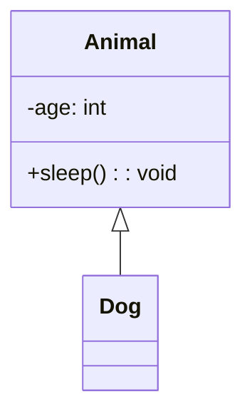
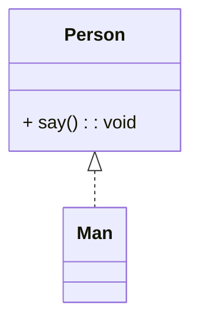
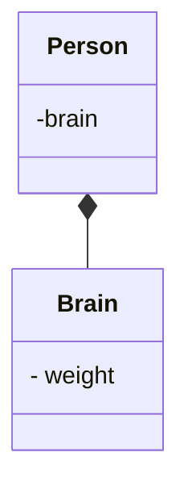
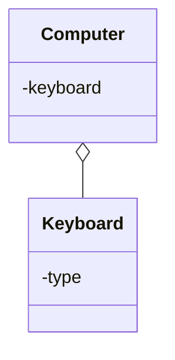
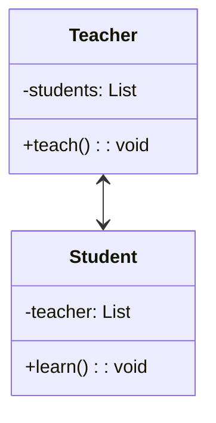
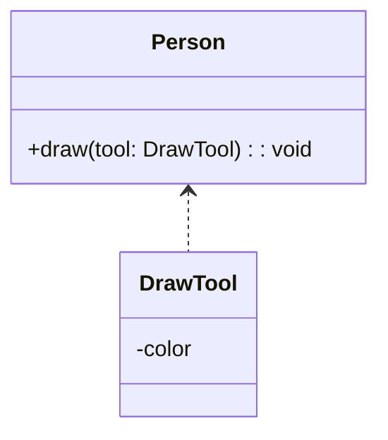

# Markdown使用mermaid

<!--more-->
# Markdown使用mermaid

## 0. 符号表示

- 类元素的可见范围

  | 可见范围  | 表示方法 |
  | --------- | -------- |
  | private   | -        |
  | public    | +        |
  | protected | #        |
  | package   | ~        |

- 类的修饰

  | 符号              | 类型      |
  | ----------------- | --------- |
  | `<<Interface>>`   | 接口      |
  | `<<abstract>>`    | 抽象类    |
  | `<<Service>>`     | service类 |
  | `<<enumeration>>` | 枚举      |

## 1. 泛化
- 定义: 表示继承关系(子类和父类).
- 表示:三角实线,指向父类.

## 2. 实现
- 定义: 表示类和接口之间的关系.
- 表示: 三角虚线,指向接口.

## 3. 组合
- 定义: 整体与局部的关系,部分不能离开整体单独存在,称为强聚合,属于关联关系的一种.
- 表示: 实心菱形实线,实心菱形指向整体.
- 代码体现: 成员变量

## 4. 聚合
- 定义: 整体与局部的关系,部分能离开整体单独存在,称为强聚合,属于关联关系的一种.
- 表示: 空心菱形实线,空心菱形指向整体.
- 代码体现: 成员变量

## 5. 关联
- 定义: 一种拥有的关系, 使一个类知道另一个类的属性和方法,关联可以是单向的,也可以是双向的.双向的关联可以有两个箭头或者没有箭头，单向的关联有一个箭头.
- 表示: 普通箭头的实心线,指向被拥有者.
- 代码体现: 成员变量

## 6. 依赖
- 定义: 一种使用关系.
- 表示: 普通箭头的虚线,箭头指向被使用者
- 代码体现: 局部变量, 方法的形参, 方法返回值静态方法的调用

## 7. 各种关系强弱顺序
- 泛化 = 实现 > 组合 > 聚合 > 关联 > 依赖

---

> 作者:   
> URL: https://blog-12x.pages.dev/markdown%E4%BD%BF%E7%94%A8mermaid/  

